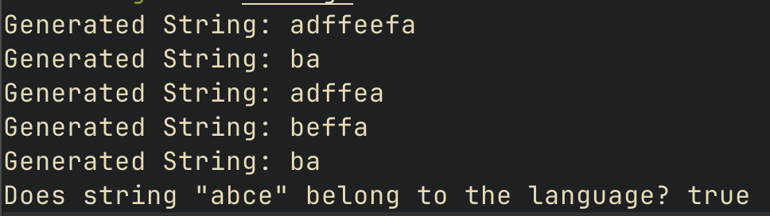
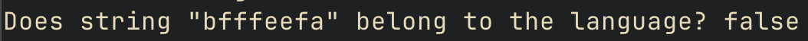

# Implementation of Grammar and Finite Automaton

### Course: Formal Languages & Finite Automata

### Author: Amza Vladislav

---

## Theory

In formal language theory, a **grammar** defines a set of production rules used to generate strings from a given alphabet. The grammar consists of non-terminal symbols, terminal symbols, and production rules. A **finite automaton** is a computational model that accepts or rejects strings of symbols based on state transitions, using a set of states, an alphabet, a transition function, a start state, and a set of accepting states.

In this work, we implemented a **context-free grammar** (CFG) to generate strings and a **deterministic finite automaton** (DFA) to verify if a string belongs to a given language. The grammar and automaton are tied together to showcase the relationship between grammar and automaton theory.

## Objectives:

- To implement a context-free grammar that generates strings from a defined language.
- To implement a finite automaton that accepts or rejects strings based on state transitions.
- To combine the two components and verify whether generated strings belong to the language recognized by the finite automaton.

## Implementation description

### 1. Grammar Structure and Generation

The **grammar** is defined using the following components:

- **Non-terminal symbols (Vn)**: `{S, P, Q}`.
- **Terminal symbols (Vt)**: `{a, b, c, d, e, f}`.
- **Production rules**: Define how non-terminal symbols are replaced by other symbols. For example, the start symbol `S` can be replaced by either `aP` or `bQ`.
- **Start symbol**: `S`.

The grammar generates strings by recursively replacing non-terminal symbols with one of their production rules. The `GenerateString()` function starts with `S`, selects a random production, and continues expanding until only terminal symbols remain.

The core logic of the grammar involves recursively replacing non-terminals. The replacement is done using predefined production rules stored in a dictionary. Whenever a non-terminal is encountered, one of its corresponding rules is randomly chosen to determine the next segment of the string.

```go
func (g *Grammar) GenerateString() string {
    return g.generateFromNonTerminal(g.StartSymbol)
}

func (g *Grammar) generateFromNonTerminal(nonTerminal string) string {
    productions := g.Production[nonTerminal]
    production := productions[rand.Intn(len(productions))]
    
    var result strings.Builder
    for _, symbol := range production {
        if _, isTerminal := g.Vt[string(symbol)]; isTerminal {
            result.WriteString(string(symbol))
        } else {
            result.WriteString(g.generateFromNonTerminal(string(symbol)))
        }
    }
    return result.String()
}
```

This function works by first identifying whether the symbol is a terminal or a non-terminal. If it is a terminal, it is appended directly to the resulting string. If it is a non-terminal, the function is called recursively to replace it with one of its production rules, continuing until a fully expanded string is produced.

### 2. Finite Automaton Structure

The **finite automaton** is defined by:

- **States**: `{q0, q1, q2, q3}`.
- **Input alphabet**: `{a, b, c, d, e, f}`.
- **Start state**: `q0`.
- **Accepting state**: `q3`.
- **Transition function**: Defines the state transitions based on the input symbols.

The finite automaton processes an input string by transitioning between states based on the provided transition rules. If, after reading all characters, the automaton ends in an accepting state, the string is considered valid.

```go
func (fa *FiniteAutomaton) StringBelongToLanguage(inputString string) bool {
    currentState := fa.q0
    
    for _, symbol := range inputString {
        stateTransition, exists := fa.Delta[currentState][string(symbol)]
        if !exists {
            return false
        }
        currentState = stateTransition
    }
    
    _, isAcceptingState := fa.F[currentState]
    return isAcceptingState
}
```

This function starts at the initial state and processes each character of the input string one by one, using the transition rules to determine the next state. If no valid transition exists for a character, the function immediately returns `false`, indicating the string is not in the language. If the function reaches an accepting state at the end of the string, it returns `true`.

### 3. Main Application Logic

The main program generates strings using the grammar and tests them against the automaton. It calls the `GenerateString()` function from the grammar and checks if the generated string belongs to the language defined by the automaton using the `StringBelongToLanguage()` function.

```go
func main() {
    rand.New(rand.NewSource(time.Now().UnixNano()))
    grammarInstance := grammar.NewGrammar()

    for i := 0; i < 5; i++ {
        fmt.Println("Generated String:", grammarInstance.GenerateString())
    }

    automatonInstance := automaton.NewFiniteAutomaton()
    testString := "abce"
    fmt.Printf("Does string \"%s\" belong to the language? %v\n", testString, automatonInstance.StringBelongToLanguage(testString))
}
```

The program runs multiple tests to verify the correctness of the implementation. It first generates five random strings from the grammar and displays them. Then, it checks if a predefined test string belongs to the language defined by the automaton, printing the result.

## Results



## Conclusions

The implementation successfully demonstrates the relationship between context-free grammar and finite automata. The grammar generates valid strings, and the finite automaton is able to verify whether the generated strings belong to the language it recognizes. The combination of these two components shows how formal languages can be both generated and recognized using automata.

## References

1. Hopcroft, J. E., Motwani, R., & Ullman, M. (2006). *Introduction to Automata Theory, Languages, and Computation* (3rd ed.). Pearson.
2. Sipser, M. (2012). *Introduction to the Theory of Computation* (3rd ed.). Cengage Learning.
